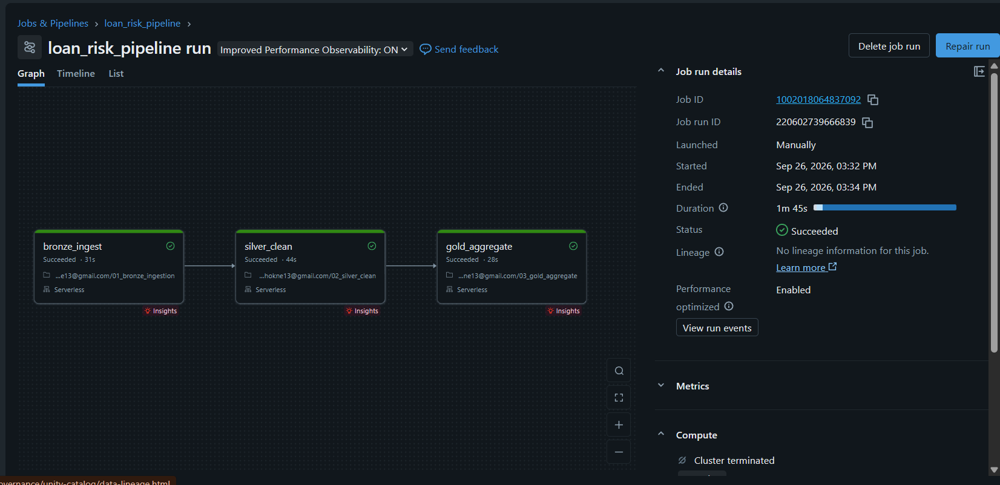

# Loan Default Risk Pipeline (Databricks)

An end-to-end ETL pipeline built on Databricks that turns raw Lending Club loan data into risk metrics — the kind of question a risk/portfolio team would ask about a lending book: *does loan grade or purpose actually predict default?*

## Architecture

Bronze → Silver → Gold (medallion architecture), so raw source data is never overwritten and every downstream table can be traced back to its origin.

```
bronze.loans_raw          → raw CSV, untouched
bronze.borrowers_raw      → raw JSON, untouched
silver.loans_clean        → typed, deduplicated, nulls handled
silver.loans_joined       → loans + borrower info, joined on id
gold.default_by_grade     → default rate & avg interest rate per loan grade
gold.default_by_purpose   → default rate per loan purpose
gold.exposure_by_state    → total outstanding loan amount per state
```

## Tech Stack

Python, PySpark, SQL, Delta Lake, Databricks Workflows (serverless compute)

## Pipeline

Three chained notebooks, scheduled and run as one Databricks Job:

`01_bronze_ingestion` → `02_silver_clean` → `03_gold_aggregate`


*All three tasks succeeded in 1m 45s on serverless compute.*

## Key Finding

Default rate climbs sharply and consistently with loan grade:

| Grade | Total Loans | Default Rate | Avg Interest Rate |
|---|---|---|---|
| A | 433,027 | 3.28% | 7.08% |
| B | 663,557 | 7.92% | 10.68% |
| C | 650,053 | 13.18% | 14.14% |
| D | 324,424 | 18.82% | 18.14% |
| E | 135,639 | 26.57% | 21.83% |
| F | 41,800 | 34.67% | 25.45% |
| G | 12,168 | 37.48% | 28.07% |

Default rate is over **11x higher for grade G than grade A**, and it tracks almost perfectly with the interest rate assigned at issuance — a good sign that Lending Club's own risk grading holds up against actual outcomes.

**By loan purpose**, `small_business` loans default the most (18.55%), followed by `renewable_energy` (15.29%) and `moving` (14.37%) — consistent with small business loans carrying genuine operating risk. `debt_consolidation` is the largest single category by far (1.28M loans) at a moderate 12.91% default rate, so it dominates the overall portfolio's risk profile despite not being the highest-risk category itself. `car` (8.93%) and `credit_card` (9.67%) loans default the least.

**By state**, `CA` carries the most total exposure ($4.81B across ~314k loans), followed by `TX` ($2.93B) and `NY` ($2.77B) — this tracks population and economic size rather than pointing to elevated risk in any one state.

## Data Quality

Two automated checks run as part of the pipeline:
- No null `id` values in the cleaned loans table
- No duplicate `id` values in the cleaned loans table

## Data Source

Full dataset: [Lending Club Loan Data](https://www.kaggle.com/datasets/wordsforthewise/lending-club) (Kaggle) — download `accepted_2007_to_2018Q4.csv` and see the pipeline notebooks below for the exact schema and columns used.

## How to Run

1. Upload `accepted_loans.csv` and `borrower_info.json` to a Unity Catalog Volume
2. Run `01_bronze_ingestion`, then `02_silver_clean`, then `03_gold_aggregate`
3. Or trigger the whole thing via the scheduled `loan_risk_pipeline` Job

## What I'd Do at Scale

Partition large tables by loan issue date, run `OPTIMIZE`/`ZORDER` on the Delta tables for faster queries, and replace the manual `assert` checks with Delta Live Tables expectations or Great Expectations for continuous monitoring.
